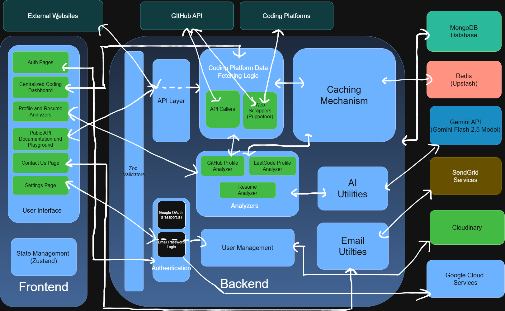
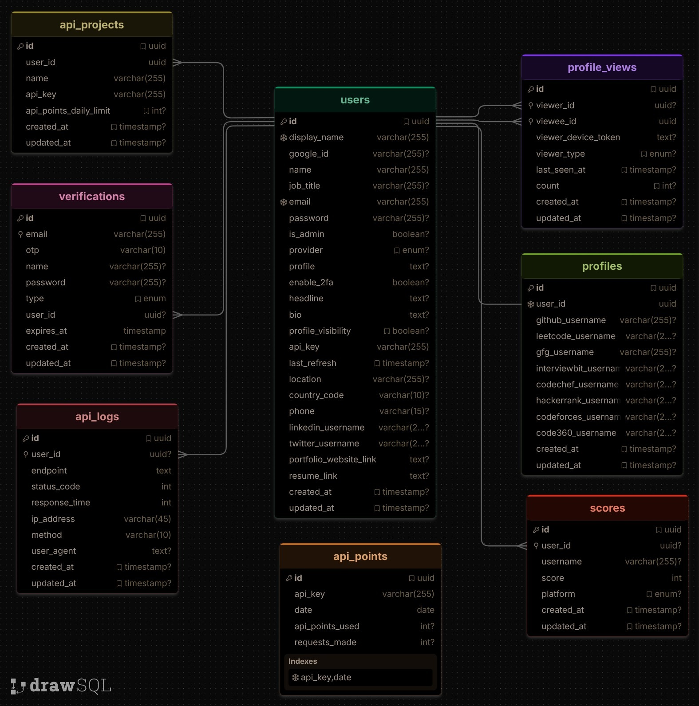
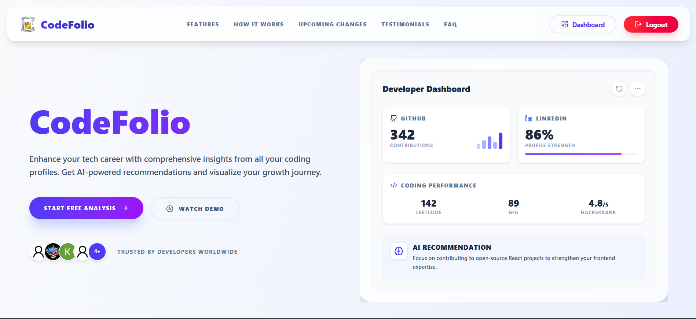
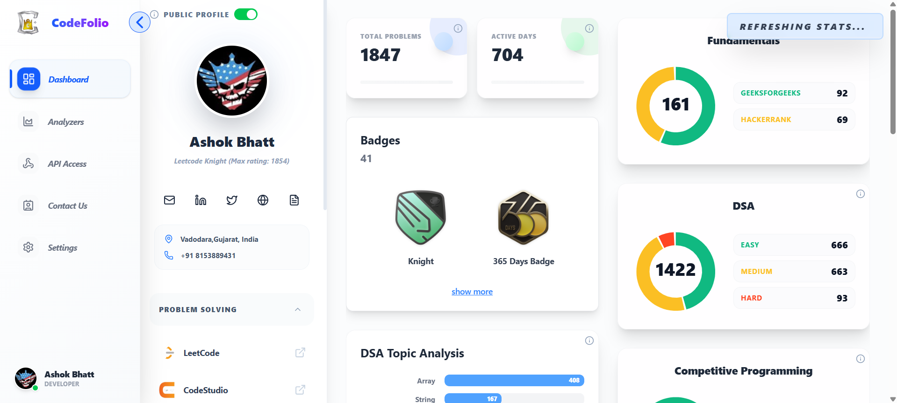
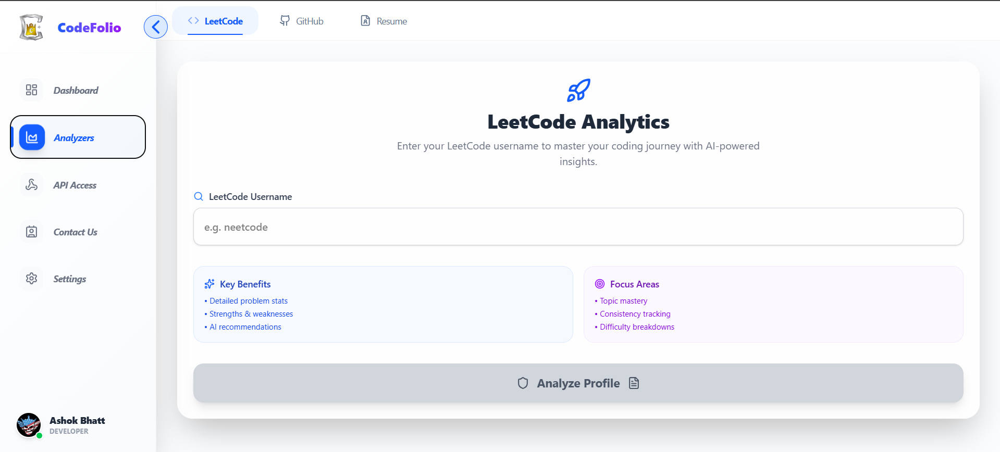
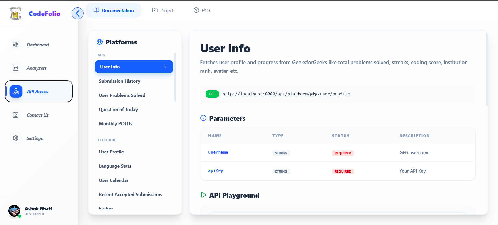
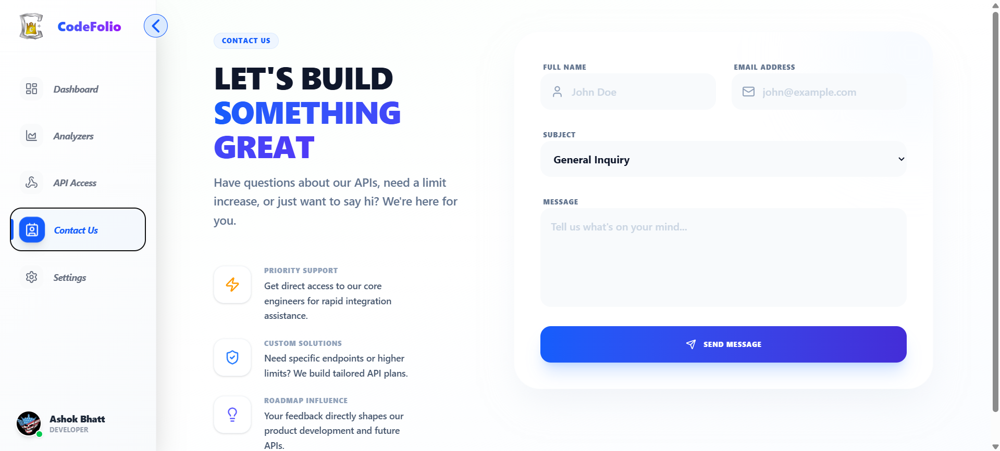
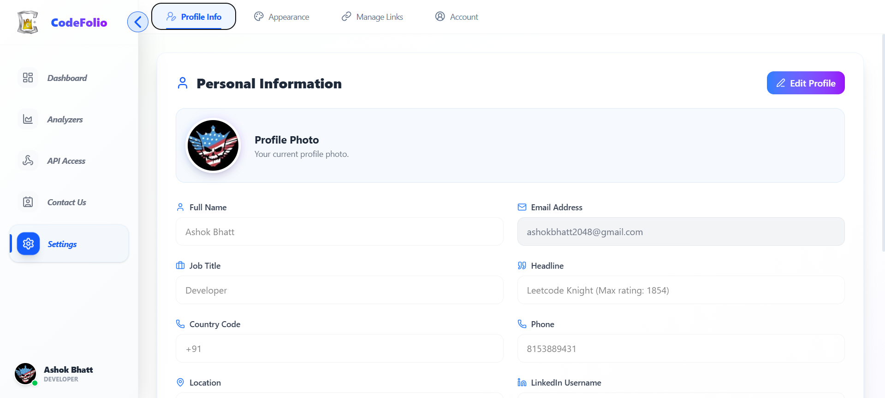
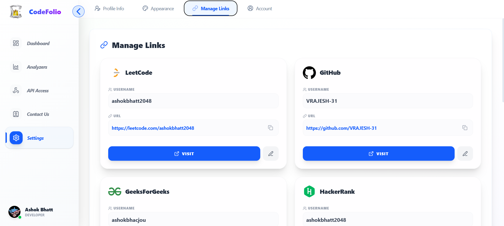
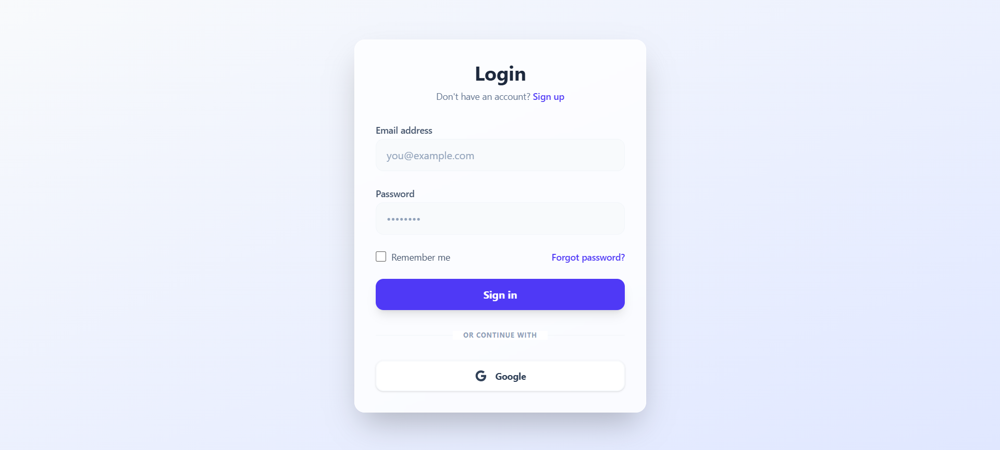

# CodeFolio
**AI-powered developer intelligence platform that unifies coding profiles, analyzes strengths, and exposes reusable public APIs.**

## Overview
CodeFolio Insights helps developers and recruiters evaluate technical growth from one place.  
Instead of manually checking LeetCode, GitHub, GeeksforGeeks, CodeChef, InterviewBit, Code360, and HackerRank separately, this project aggregates profile data, visualizes progress, computes scores, and generates AI feedback for:

- Coding profile performance
- GitHub portfolio quality
- Resume quality and job-description alignment

It also provides a **Public API product** with API keys, project-level usage tracking, and daily point-based quotas.

## Features
- Unified dashboard for multi-platform coding activity
- Profile link management for supported platforms
- AI-driven LeetCode and GitHub analysis with score breakdowns
- AI resume analysis from uploaded PDF resumes
- Shareable profile pages with privacy controls
- Auth system with email/password, Google OAuth, OTP verification, and optional 2FA
- Public API playground + endpoint documentation UI
- API key/project management for users
- Daily API point limits and per-endpoint cost metering
- API request analytics and usage charts
- Contact form integration via SendGrid
- Profile image upload via Cloudinary
- Redis-backed caching for expensive profile/analysis fetches

## Tech Stack
- Frontend: React 19, React Router, Vite, Tailwind CSS v4, Zustand, React Query, Axios, Recharts, Framer Motion
- Backend: Node.js, Express, Mongoose, Zod, Passport (Google OAuth), JWT, Multer, Puppeteer
- AI: Google Gemini (`@google/genai`)
- Database: MongoDB
- Cache: Upstash Redis
- Email: SendGrid
- Media Storage: Cloudinary
- Tooling: ESLint, Prettier, Nodemon

## Architecture / How It Works


## Database Schema (MongoDB)
The core entities and their relationships are visualized below:



Core backend flow:
1. `frontend` calls `backend` with cookie/JWT auth where required.
2. Backend validates request using Zod middleware.
3. For public platform APIs, request passes through:
   - API key verification
   - API point cost calculation and daily limit enforcement
   - analytics logging
4. Data is fetched from platform APIs/scrapers, normalized, merged, and cached.
5. Analyzer endpoints enrich data with Gemini-based recommendations and scoring.
6. Results are returned for dashboard visualizations and reports.

## Folder Structure
```text
CodeFolio-Insights/
├── backend/
│   ├── src/
│   │   ├── app.js / index.js              # Express app + server bootstrap
│   │   ├── config/                        # env, DB, Redis, Passport, Puppeteer
│   │   ├── routes/                        # auth, user, profile, analyze, platform APIs, etc.
│   │   ├── controllers/                   # request handling
│   │   ├── services/                      # business logic and platform integrations
│   │   ├── models/                        # Mongoose schemas
│   │   ├── middlewares/                   # auth, validation, API key, rate limiting, analytics
│   │   ├── utils/                         # scoring, fetchers, Gemini, PDF, cloudinary, sendgrid
│   │   ├── validators/                    # Zod request schemas
│   │   ├── constants/                     # platform queries, API costs, common constants
│   │   └── seeders/                       # admin/dummy user seeders
│   └── render-build.sh                    # Render deployment helper for Puppeteer Chrome
├── frontend/
│   ├── src/
│   │   ├── main.jsx / App.jsx             # React bootstrap + route graph
│   │   ├── pages/                         # landing, analyzers, dashboard, settings, public APIs
│   │   ├── components/                    # UI cards/charts/forms/modals
│   │   ├── layouts/                       # route shells and protected layouts
│   │   ├── hooks/                         # React Query data layer
│   │   ├── api/                           # axios instance + auth header interceptor
│   │   ├── store/                         # Zustand auth + preferences stores
│   │   ├── constants/                     # UI config + API docs metadata
│   │   └── utils/
│   └── public/Images/                     # static assets
├── package.json                            # root lint/format scripts
└── eslint.config.mjs
```

## Installation & Setup

### Prerequisites
- Node.js 20+ recommended
- npm
- MongoDB instance
- Upstash Redis database
- Google Gemini API key
- SendGrid account
- Cloudinary account
- GitHub token
- Google OAuth credentials (for social login)

### 1. Clone & Install
```bash
git clone <your-repo-url>
cd CodeFolio-Insights
npm install
cd backend && npm install
cd ../frontend && npm install
```

### 2. Backend Environment (`backend/.env`)
```env
PORT=8080
MONGO_CONN=mongodb+srv://<user>:<pass>@<cluster>/<db>
DB_NAME=codefolio
JWT_SECRET=your_jwt_secret
SESSION_SECRET=your_session_secret
CORS_ORIGIN=http://localhost:5173

# Admin bootstrap
ADMIN_EMAIL=admin@example.com
ADMIN_PASSWORD=strong_password
ADMIN_USERNAME=admin

# GitHub integration
GITHUB_TOKEN=ghp_xxx

# Gemini
GEMINI_API_KEY=your_gemini_key
GEMINI_LLM_MODEL=gemini-2.5-flash

# Google OAuth
GOOGLE_CLIENT_ID=xxx
GOOGLE_CLIENT_SECRET=xxx
GOOGLE_CALLBACK_URL=http://localhost:8080/api/auth/google/callback

# Redis cache
UPSTASH_REDIS_REST_URL=https://<your-upstash-url>
UPSTASH_REDIS_REST_TOKEN=<your-upstash-token>

# SendGrid
SENDGRID_API_KEY=SG.xxx
EMAIL_FROM=you@domain.com

# Cloudinary
CLOUDINARY_CLOUD_NAME=xxx
CLOUDINARY_API_KEY=xxx
CLOUDINARY_API_SECRET=xxx

# Optional (mostly for production Puppeteer runtime)
PUPPETEER_EXECUTABLE_PATH=/usr/bin/google-chrome
```

### 3. Frontend Environment (`frontend/.env`)
```env
VITE_SERVER_BASE_URL=http://localhost:8080
VITE_ENV=development
```

### 4. Run in Development
Open two terminals:

```bash
cd backend
npm run dev
```

```bash
cd frontend
npm run dev
```

Frontend: `http://localhost:5173`  
Backend health check: `http://localhost:8080/health`

### 5. Production Build
```bash
cd frontend
npm run build
npm run preview
```

```bash
cd backend
npm start
```

## Usage
1. Sign up or log in (email/password + OTP, or Google OAuth).
2. Add platform usernames in **Settings → Manage Links**.
3. Open dashboard to view combined coding metrics, badges, and heatmaps.
4. Use **Analyzer** for LeetCode, GitHub, or resume scoring.
5. Create API projects in **Public APIs → Projects** to generate/manage API keys.
6. Test endpoints in **Public APIs → Documentation** interactive playground.
7. Monitor API usage in analytics endpoints.

## API Documentation (Key Endpoints)

### Auth & User
- `POST /api/auth/signup`
- `POST /api/auth/login`
- `POST /api/auth/verify-otp`
- `GET /api/auth/check`
- `POST /api/auth/logout`
- `GET /api/auth/google`
- `GET /api/auth/google/callback`
- `GET /api/user/:displayName`
- `PATCH /api/user` (profile update + optional image)
- `PATCH /api/user/password`
- `PATCH /api/user/visibility`
- `PATCH /api/user/2fa`
- `PATCH /api/user/api-key`

### Profile & Dashboard
- `GET /api/profile/:displayName`
- `GET /api/profile/cache/:displayName`
- `GET /api/profile/fetch/:displayName`
- `PATCH /api/profile/platform`

### Analyzers
- `GET /api/analyze/leetcode?username=...`
- `GET /api/analyze/github?username=...`
- `POST /api/analyze/resume` (`multipart/form-data`, `resume` PDF field)

### Public Platform APIs (API key required via `?apiKey=...`)
Base: `GET /api/platform/*`
- LeetCode: profile, language stats, calendar, badges, contests, POTD, rankings, etc.
- GFG: profile, submissions, problems, POTD, monthly POTD
- CodeChef: profile, submissions
- Code360: profile, submissions
- InterviewBit: profile, submissions, badges
- HackerRank: profile
- GitHub: contribution badges

### API Key Project Management
- `GET /api/project/all`
- `GET /api/project/:projectId`
- `POST /api/project`
- `PUT /api/project`
- `DELETE /api/project/:projectId`

### Analytics
- `GET /api/analytics/daily-usage`
- `GET /api/analytics/api-requests-data`

## Screenshots / UI

<table align="center">
  <tr>
    <td align="center">
      <br/>
      <b>Landing Page</b>
    </td>
    <td align="center">
      <br/>
      <b>Dashboard</b>
    </td>
  </tr>

  <tr>
    <td align="center">
      <br/>
      <b>Analyzer</b>
    </td>
    <td align="center">
      <br/>
      <b>Public API Docs</b>
    </td>
  </tr>

  <tr>
    <td align="center">
      <br/>
      <b>Contact Us</b>
    </td>
    <td align="center">
      <br/>
      <b>Profile</b>
    </td>
  </tr>

  <tr>
    <td align="center">
      <br/>
      <b>Link Updation Page</b>
    </td>
    <td align="center">
      <br/>
      <b>Login Page</b>
    </td>
  </tr>
</table>

## Future Improvements
- Add additional platforms (Codeforces, AtCoder, HackerEarth, TopCoder, Kaggle)
- Add Leaderboard feature to track the rankings of all public CodeFolio profiles
- Improve API observability (dashboard + per-endpoint latency monitoring)
- Introduce API versioning and OpenAPI/Swagger generation
- Add background job queue for heavy scraping/analyzer tasks
- Improve test coverage (unit + integration + e2e)
- Add Dockerized local setup
- Make Platform responsive for different screen sizes
- Add dark modes and multiple themes

## Contributing
Refer to [CONTRIBUTING.md](CONTRIBUTING.md) file.

Suggested local checks:
```bash
npm run lint
npm run format
```

## License
This project is licensed under the **MIT License**. See the [LICENSE](LICENSE) file for more details.